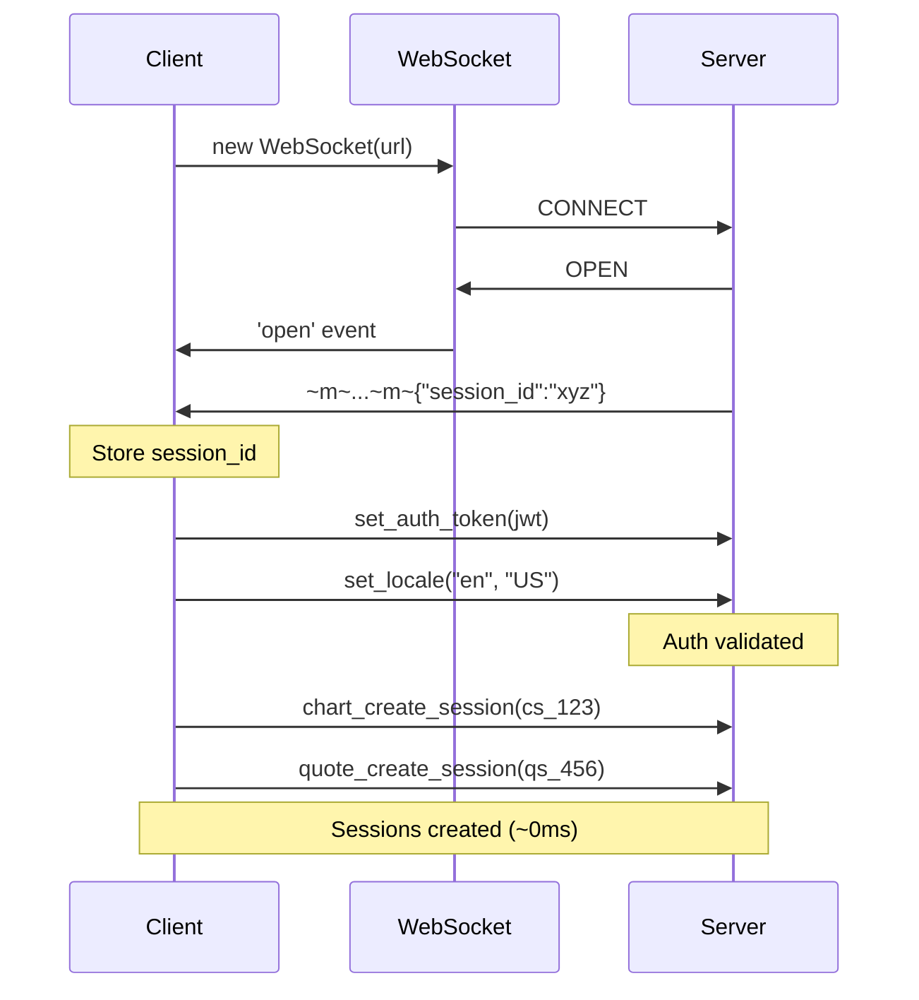
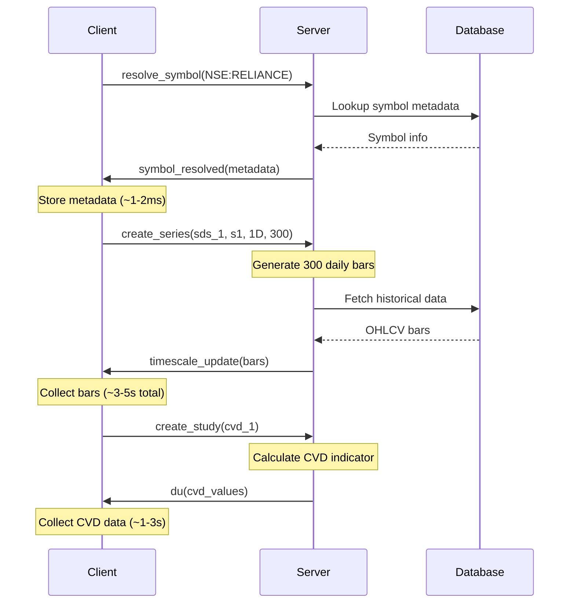
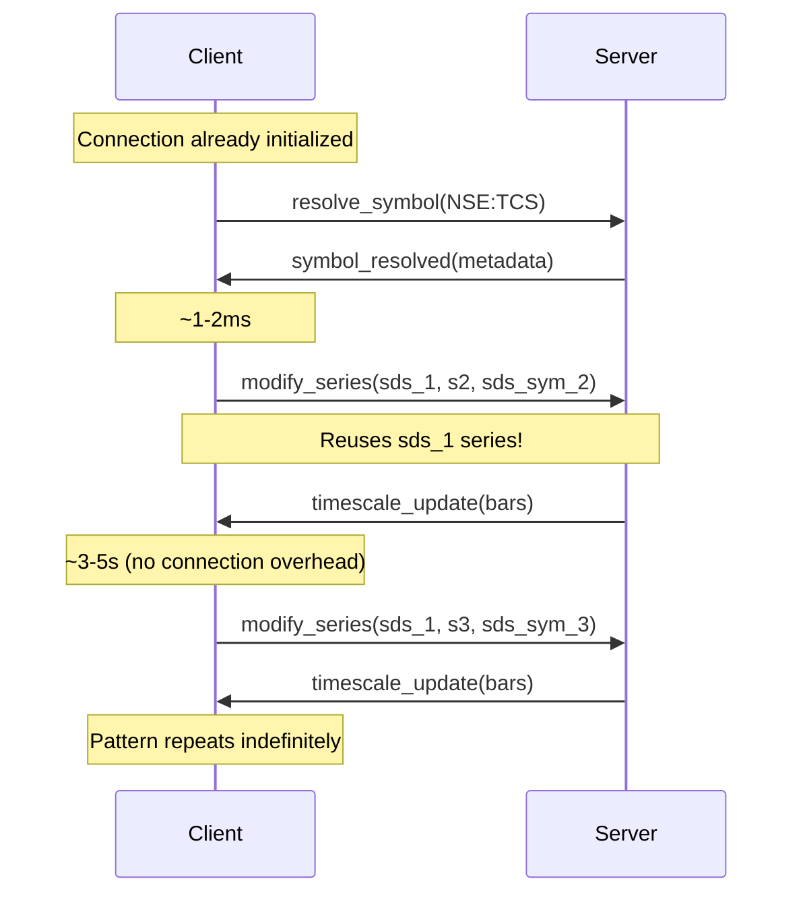
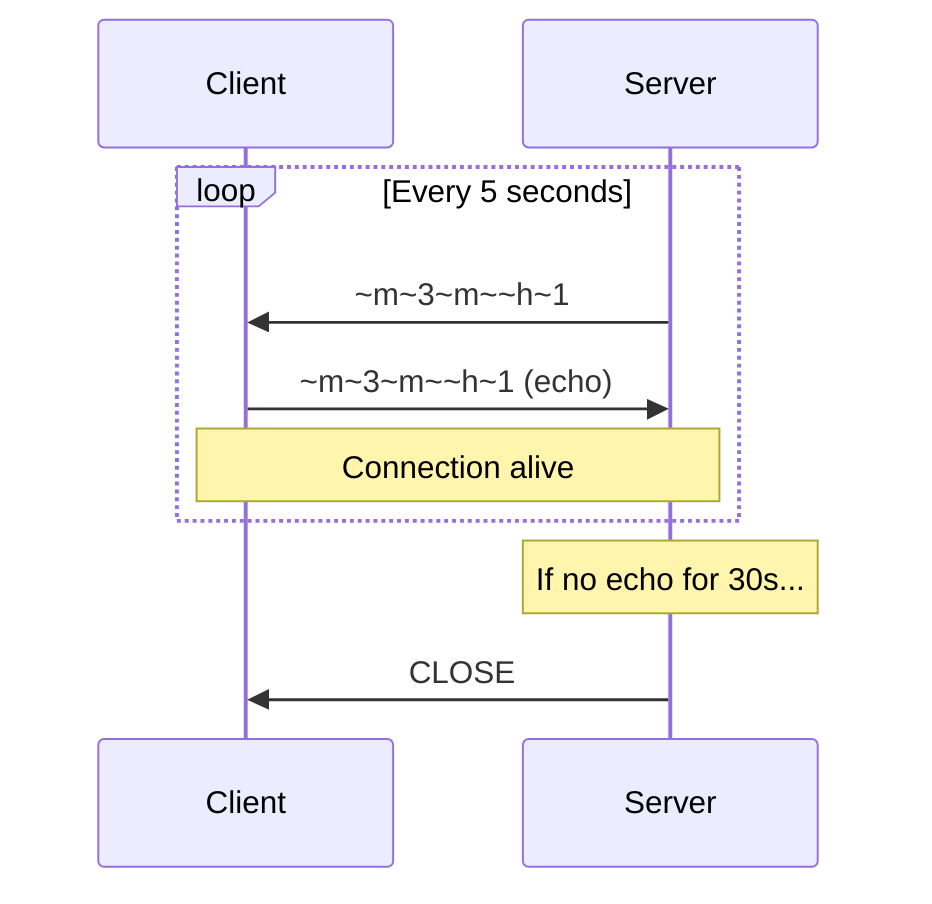
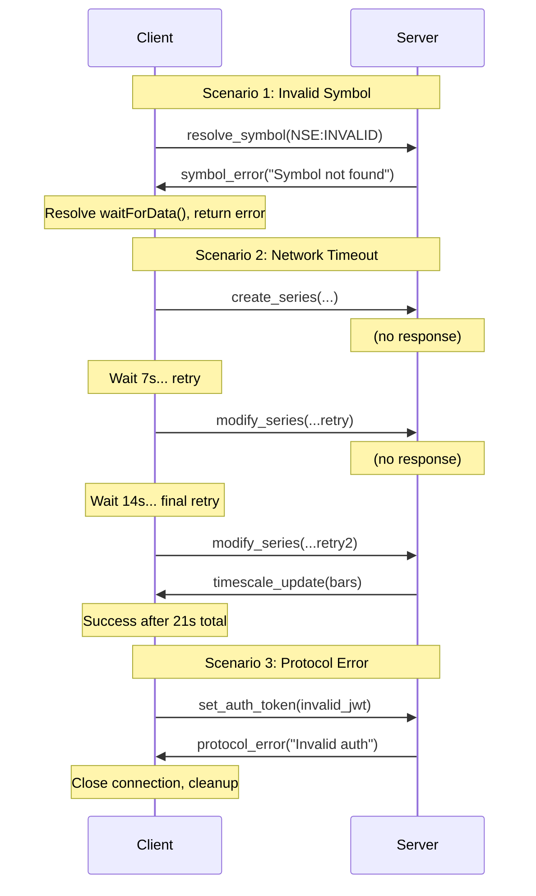
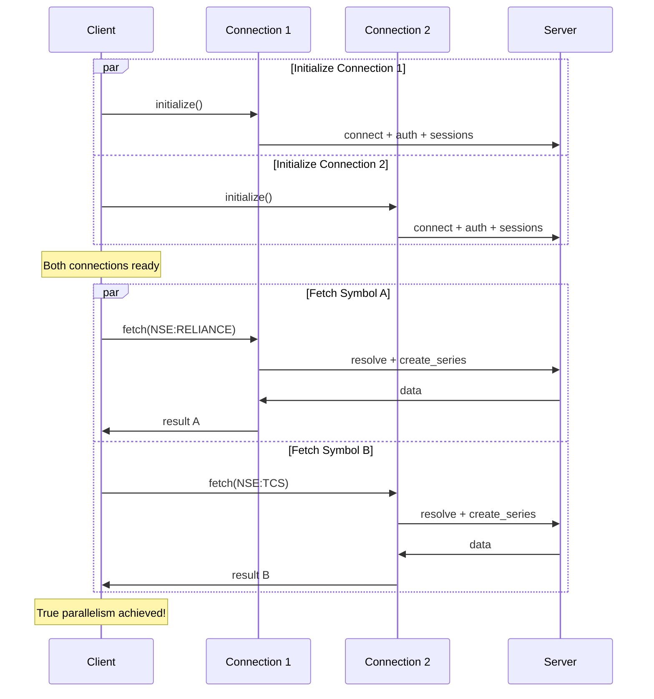

# TradingView WebSocket Protocol - Complete Reference

**Version:** 1.0  
**Last Updated:** December 24, 2025  
**Status:** Production Reference

---

## Table of Contents

1. [Overview](#overview)
2. [Frame Format](#frame-format)
3. [Connection Lifecycle](#connection-lifecycle)
4. [Symbol Switching Mechanism](#symbol-switching-mechanism)
5. [Data Flow & Completion](#data-flow--completion)
6. [Keep-Alive Mechanism](#keep-alive-mechanism)
7. [Error Handling](#error-handling)
8. [Protocol Constraints](#protocol-constraints)
9. [Sequence Diagrams](#sequence-diagrams)
10. [Performance Characteristics](#performance-characteristics)

---

## Overview

TradingView's WebSocket API uses a **custom binary frame protocol** with **JSON-RPC style messaging**. The protocol is designed for real-time financial data streaming with support for:

- Multiple chart sessions per connection
- Symbol switching without reconnection
- Real-time indicators/studies (CVD, RSI, etc.)
- Automatic keep-alive via heartbeat mechanism

### Key Characteristics

| Property | Value | Notes |
|----------|-------|-------|
| **Endpoint** | `wss://prodata.tradingview.com/socket.io/websocket` | Requires JWT auth |
| **Protocol** | Custom frame format (`~m~`) | Not standard WebSocket JSON |
| **Auth** | JWT token via `set_auth_token` | Sent after connection |
| **Heartbeat** | `~h~N` messages every ~5s | Must echo back immediately |
| **Max connections** | ~10-20 per JWT | Rate limiting enforced |
| **Connection staleness** | 20 requests | Refresh recommended |

---

## Frame Format

### Standard Message Frame

```
~m~<length>~m~<json_payload>
```

**Example:**
```
~m~54~m~{"m":"set_auth_token","p":["eyJhbGciOiJIUzI1NiIs..."]}
```

**Components:**
- `~m~` - Frame delimiter (3 bytes)
- `<length>` - Decimal length of JSON payload (variable)
- `~m~` - Second delimiter (3 bytes)
- `<json_payload>` - JSON message object

### Multiple Messages

Multiple frames can be concatenated in a single WebSocket message:

```
~m~54~m~{"m":"set_auth_token","p":["..."]}~m~28~m~{"m":"set_locale","p":["en","US"]}
```

### Heartbeat Frame

```
~m~3~m~~h~1
```

**Special handling:** Heartbeats must be **echoed back** exactly as received to maintain connection.

---

## Connection Lifecycle

The connection follows a **strict 7-step initialization sequence**:

### Step 1: WebSocket Connect

```typescript
ws = new WebSocket('wss://prodata.tradingview.com/socket.io/websocket', {
  headers: {
    'Origin': 'https://www.tradingview.com',
    'User-Agent': 'Mozilla/5.0 (Macintosh; Intel Mac OS X 10_15_7) AppleWebKit/537.36'
  }
});
```

**Query Parameters:**
- `from` - Source reference (e.g., `chart/S09yY40x/`)
- `date` - ISO timestamp (e.g., `2025-12-24T10:30:00Z`)
- `type` - Connection type (`chart`, `screener`, etc.)

**Timeout:** 30 seconds (connection must complete)

### Step 2: Handshake Response

**Server sends:**
```json
{
  "session_id": "z1y2x3w4v5u6t7s8r9"
}
```

**Action:** Store `session_id` for debugging/logging

### Step 3: Authentication

**Client sends (immediately, no delay):**
```json
{
  "m": "set_auth_token",
  "p": ["eyJhbGciOiJIUzI1NiIsInR5cCI6IkpXVCJ9..."]
}
```

```json
{
  "m": "set_locale",
  "p": ["en", "US"]
}
```

**Performance:** ~0ms delay (was 700ms with unnecessary sleeps)

### Step 4: Create Sessions

**Client sends (immediately, no delay):**
```json
{
  "m": "chart_create_session",
  "p": ["cs_ABC123XYZ", ""]
}
```

```json
{
  "m": "quote_create_session",
  "p": ["qs_DEF456UVW"]
}
```

**Session IDs:** Random 12-character alphanumeric strings with prefix:
- `cs_` - Chart session
- `qs_` - Quote session

**Performance:** ~0ms delay (was 400ms with unnecessary sleeps)

### Step 5: Resolve Symbol

**Client sends:**
```json
{
  "m": "resolve_symbol",
  "p": [
    "cs_ABC123XYZ",           // Chart session ID
    "sds_sym_1",              // Symbol session ID
    "={\"symbol\":\"NSE:RELIANCE\",\"adjustment\":\"dividends\"}"
  ]
}
```

**Server responds (~1-2ms):**
```json
{
  "m": "symbol_resolved",
  "p": [
    "cs_ABC123XYZ",
    "sds_sym_1",
    {
      "name": "RELIANCE",
      "full_name": "NSE:RELIANCE",
      "ticker": "RELIANCE",
      "exchange": "NSE",
      "type": "stock",
      "timezone": "Asia/Kolkata",
      "minmov": 1,
      "pricescale": 100,
      "session": "0915-1530"
    }
  ]
}
```

**Error case:**
```json
{
  "m": "symbol_error",
  "p": ["cs_ABC123XYZ", "NSE:INVALID", "Symbol not found"]
}
```

### Step 6: Create Series (First Symbol)

**Client sends:**
```json
{
  "m": "create_series",
  "p": [
    "cs_ABC123XYZ",   // Chart session ID
    "sds_1",          // Series ID (constant)
    "s1",             // Turnaround ID (increments)
    "sds_sym_1",      // Symbol session ID
    "1D",             // Resolution (1, 5, 15, 30, 60, 1D, 1W, 1M)
    300,              // Number of bars
    ""                // Range (empty for bar count)
  ]
}
```

**Server responds (3-5 seconds for 300 bars):**
```json
{
  "m": "timescale_update",
  "p": [
    "cs_ABC123XYZ",
    {
      "sds_1": {
        "s": [
          { "i": 0, "v": [1703376000, 2450.50, 2475.25, 2445.00, 2470.75, 5000000] },
          { "i": 1, "v": [1703462400, 2470.75, 2490.00, 2465.50, 2485.25, 4800000] }
        ]
      }
    }
  ]
}
```

**Bar format:** `[time, open, high, low, close, volume]`

### Step 7: Modify Series (Subsequent Symbols)

**Client sends:**
```json
{
  "m": "modify_series",
  "p": [
    "cs_ABC123XYZ",   // Chart session ID (same)
    "sds_1",          // Series ID (same)
    "s2",             // Turnaround ID (incremented)
    "sds_sym_2",      // Symbol session ID (new)
    "1D",             // Resolution
    ""                // Range
  ]
}
```

**Key insight:** Reuses `sds_1` series, only changes `turnaroundId` and `symbolSessionId`. This enables **connection pooling**.

---

## Symbol Switching Mechanism

The **modify_series** mechanism is the foundation of connection pooling:

| Request # | Message Type | Series ID | Turnaround ID | Symbol Session ID | Purpose |
|-----------|-------------|-----------|---------------|-------------------|---------|
| 1 | `create_series` | `sds_1` | `s1` | `sds_sym_1` | Initialize chart |
| 2 | `modify_series` | `sds_1` | `s2` | `sds_sym_2` | Switch symbol |
| 3 | `modify_series` | `sds_1` | `s3` | `sds_sym_3` | Switch again |
| N | `modify_series` | `sds_1` | `sN` | `sds_sym_N` | Keep reusing |

### Why This Matters

- **One connection** can serve **unlimited symbols** sequentially
- No need to reconnect for different symbols
- ~90% faster than creating new connections (3s → 300ms)
- Reduces server load and improves reliability

### Constraint: Sequential Processing

**Cannot parallelize on same connection:**
```typescript
// ❌ BAD: Parallel requests on same connection
await Promise.all([
  conn.fetchSymbol('NSE:RELIANCE'),
  conn.fetchSymbol('NSE:TCS')
]);
// Result: Data mixing, corrupted bars

// ✅ GOOD: Sequential requests on same connection
await conn.fetchSymbol('NSE:RELIANCE');
await conn.fetchSymbol('NSE:TCS');
```

**For parallelism:** Use multiple connections (max 2 for family app).

---

## Data Flow & Completion

### Message Types

| Message | Direction | Purpose | Timing |
|---------|-----------|---------|--------|
| `du` | Server → Client | Data update (incremental) | During data stream |
| `timescale_update` | Server → Client | Complete dataset | After request |
| `symbol_resolved` | Server → Client | Symbol metadata | ~1-2ms after resolve |
| `symbol_error` | Server → Client | Invalid symbol | ~1-2ms after resolve |
| `study_loading` | Server → Client | Indicator loading | After create_study |

### Data Object Structure

```json
{
  "sds_1": {              // Main OHLCV data
    "s": [                 // Series array
      {
        "i": 0,            // Index
        "v": [time, open, high, low, close, volume]
      }
    ]
  },
  "cvd_1": {              // Study/indicator data
    "s": [
      {
        "i": 0,
        "v": [time, value1, value2, ...]  // Variable number of values
      }
    ]
  }
}
```

### Completion Detection

Data is considered **complete** when:

1. **OHLCV bars received:** `bars.length > 0`
2. **All studies received:** `receivedStudyCount >= expectedStudyCount`

**Current implementation:** Event-driven with timeout fallback

```typescript
// Wait for 'du' or 'timescale_update' message
await Promise.race([
  waitForDataMessage(),  // Resolves on data
  timeout(10000)         // Safety fallback
]);
```

### Data Identification

**OHLCV data keys:** `sds_1`, `s1`, `s2`, `s3`, etc.
- Always 6 values per bar
- Pattern: `sds_\d+` or `s\d+`

**Study data keys:** `cvd_1`, `rsi_1`, etc.
- Variable values per bar (indicator-specific)
- Pattern: Contains study ID

---

## Keep-Alive Mechanism

### Heartbeat Protocol

**Server sends (every ~5 seconds):**
```
~m~3~m~~h~1
```

**Client MUST echo back immediately:**
```typescript
if (message.startsWith('~h~')) {
  ws.send(receivedMessage);  // Echo exact message
}
```

### Failure Behavior

| Scenario | Timeout | Result |
|----------|---------|--------|
| No echo | ~30s | Connection closed by server |
| Delayed echo | ~10s | Connection marked unstable |
| Echo wrong message | Immediate | Protocol error |

### Implementation

```typescript
ws.on('message', (data) => {
  const { messages, heartbeats } = parseFrame(data.toString());
  
  // Handle heartbeats IMMEDIATELY (highest priority)
  for (const heartbeat of heartbeats) {
    if (ws.readyState === WebSocket.OPEN) {
      ws.send(heartbeat);
    }
  }
  
  // Then process messages
  for (const msg of messages) {
    handleMessage(msg);
  }
});
```

---

## Error Handling

### 1. Symbol Error

**Trigger:** Invalid or delisted symbol
```json
{
  "m": "symbol_error",
  "p": ["cs_ABC123XYZ", "NSE:INVALID", "Symbol not found"]
}
```

**Required action:**
1. Resolve any pending `waitForData()` promises
2. Return empty result or throw error
3. DO NOT hang indefinitely

### 2. Protocol Error

**Trigger:** Auth failure, rate limit, malformed request
```json
{
  "m": "protocol_error",
  "p": ["Invalid auth token"]
}
```

**Required action:**
1. Reject connection promise
2. Close WebSocket
3. Cleanup resources
4. DO NOT retry with same token (will fail again)

### 3. Network Timeout

**Trigger:** No response within timeout window

**Current issue:** Fixed timeout doesn't account for:
- Network congestion (family on shared WiFi)
- Large data requests (1000+ bars)
- Server-side delays (CVD processing)

**Solution:** Adaptive timeout with exponential backoff

```typescript
// Base timeout scales with data size
const baseTimeout = cvdEnabled && barsCount > 500 ? 10000 : 7000;

// Retry with exponential backoff
let attempt = 0;
while (attempt <= 2) {
  const timeout = baseTimeout * (attempt + 1);  // 7s, 14s, 21s
  await waitForData(timeout);
  if (dataReceived()) break;
  attempt++;
}
```

---

## Protocol Constraints

### 1. Sequential Processing Per Connection

**Constraint:** Server processes requests sequentially per chart session

**Implication:**
- Cannot send multiple `create_series` in parallel
- Must wait for data before next `modify_series`
- Parallel execution requires multiple connections

### 2. Connection Staleness

**Observation:** Connections degrade after ~20 requests

**Symptoms:**
- Slower response times
- Increased timeout frequency
- Eventually: `protocol_error`

**Solution:** Refresh connection after 20 requests

```typescript
class Connection {
  private requestCount = 0;
  private readonly MAX_REQUESTS = 20;
  
  shouldRefresh(): boolean {
    return this.requestCount >= this.MAX_REQUESTS;
  }
}
```

### 3. Rate Limiting

**Enforcement:** Per JWT token (exact limit unknown)

**Symptoms:**
- `protocol_error` messages
- Connection refused
- Slow responses

**Family app safety:** 6 connections (3 users × 2) is well below limit

### 4. Study/Indicator Delays

**CVD data timing:**
- 300 bars: 1-3 seconds
- 1000 bars: 3-5 seconds
- 2000 bars: 5-10 seconds

**Free account limitations:**
- Some indicators unavailable
- Silently fails (no error message)
- Must use timeout to detect

**Solution:** Adaptive timeout based on bar count

```typescript
// Scale timeout: 2s base + 1s per 500 bars (max 5s)
const timeout = Math.min(
  5000,
  2000 + Math.max(0, (barsCount - 300) / 500 * 1000)
);
```

---

## Sequence Diagrams

### Diagram 1: Connection Initialization



### Diagram 2: Symbol Data Fetch (First Request)



### Diagram 3: Symbol Switching (Subsequent Requests)



### Diagram 4: Heartbeat Mechanism



### Diagram 5: Error Scenarios



### Diagram 6: Parallel Execution (Multiple Connections)



---

## Performance Characteristics

### Timing Benchmarks

| Operation | Time (First) | Time (Cached) | Notes |
|-----------|-------------|---------------|-------|
| WebSocket connect | 300-500ms | N/A | Network dependent |
| Auth + sessions | ~0ms | N/A | No server response needed |
| Resolve symbol | 1-2ms | <1ms | Cached on server |
| Create series (300 bars) | 3-5s | N/A | Data generation time |
| Modify series | 3-5s | N/A | Same as create |
| CVD indicator (300 bars) | 1-3s | N/A | Server-side calculation |
| Heartbeat echo | <1ms | <1ms | Critical path |

### Connection Overhead

| Scenario | Time | Breakdown |
|----------|------|-----------|
| **New connection** | 3.5-5s | Connect (500ms) + Auth (0ms) + Sessions (0ms) + Data (3-5s) |
| **Reused connection** | 3-5s | Data only (3-5s) |
| **Savings** | 500ms | Eliminates connection handshake |

### Network Considerations

**Family app (shared WiFi) timing:**
- Normal: 3-5s per symbol
- Congested (Zoom + streaming): 7-10s
- Very congested: 10-15s (requires retry)

**Adaptive timeout strategy:**
```typescript
// Base: 7s normal, 10s with CVD
// Retry 1: 2× base (14s/20s)
// Retry 2: 3× base (21s/30s)
// Total wait: up to 42s before failure
```

---

## Best Practices

### ✅ DO

1. **Echo heartbeats immediately** - Critical for connection stability
2. **Use event-driven data waiting** - Don't rely solely on fixed timeouts
3. **Implement adaptive timeouts** - Account for network congestion and data size
4. **Refresh connections after 20 requests** - Prevent staleness issues
5. **Handle symbol_error gracefully** - Don't hang on invalid symbols
6. **Reuse connections via modify_series** - 90% faster than reconnecting
7. **Use multiple connections for parallelism** - Limited to 2 for family app

### ❌ DON'T

1. **Don't send parallel requests on same connection** - Data will mix
2. **Don't use fixed sleeps instead of waiting for events** - Wastes time or times out
3. **Don't create unlimited connections** - Rate limiting will kick in
4. **Don't ignore protocol_error** - Auth/rate limit issues won't self-resolve
5. **Don't assume data arrives in fixed time** - Network conditions vary
6. **Don't keep connections alive indefinitely** - Staleness degrades performance
7. **Don't forget to cleanup on errors** - Memory leaks and zombie connections

---

## References

- **TradingView WebSocket endpoint:** `wss://prodata.tradingview.com/socket.io/websocket`
- **Authentication:** JWT token from TradingView login
- **Rate limiting:** Undocumented (observed ~20 connections per token)

---

**Document Status:** ✅ Complete and production-ready  
**Next Steps:** Use this reference when implementing Layer 1 (WebSocketConnection)
